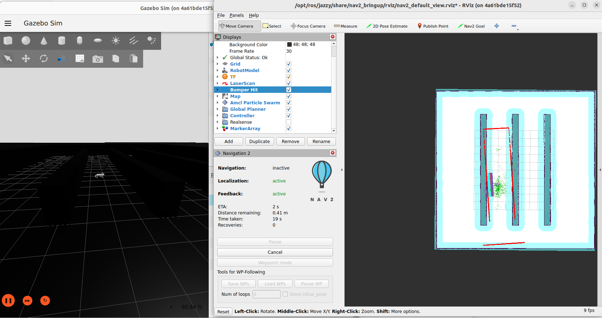
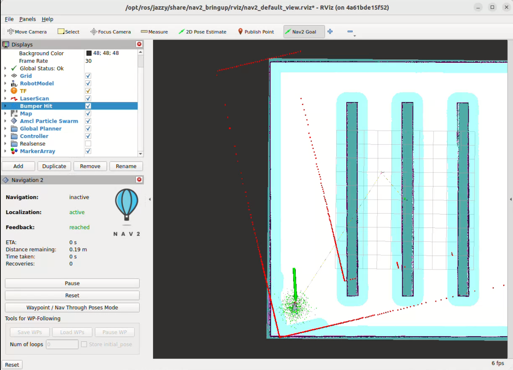
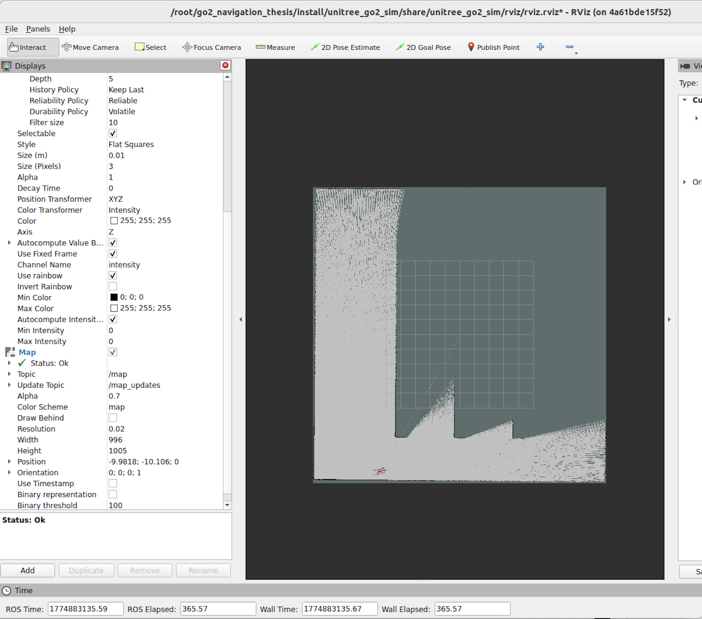
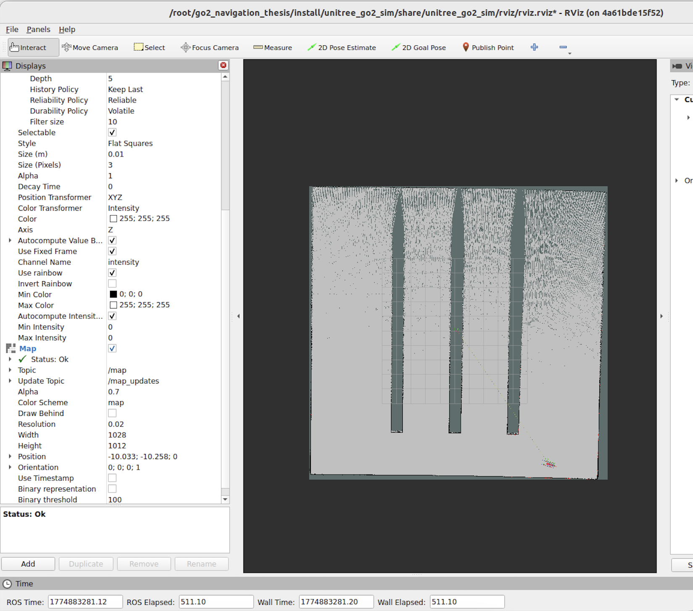

# GO2 Navigation Thesis

## Application: Autonomous Navigation and SLAM for a Quadruped Robot

This repository contains the complete simulation, mapping, localization, and navigation framework developed for a Master’s thesis focused on **Navigation and Slam_Design for Quadruped robot** in indoor warehouse environments.

The project integrates **ROS 2 Jazzy**, **Nav2**, **slam_toolbox**, **EKF sensor fusion**, and **Gazebo simulation** within a fully containerized Docker workflow.

The objective of the project is to create a reproducible and modular navigation framework capable of:

- Autonomous waypoint navigation
- SLAM map generation
- Localization and path planning
- Dynamic obstacle navigation
- Indoor warehouse inspection simulation

---

## 🟢 Verified Working Setup

This repository has been verified to work on the following setup:

- **OS:** Ubuntu 22.04
- **ROS 2:** Jazzy Jalisco
- **Simulation:** Gazebo / Ignition
- **Robot:** Unitree GO2
- **SLAM:** slam_toolbox
- **Navigation:** Nav2
- **Localization:** EKF (`robot_localization`)
- **Containerization:** Docker

---

## ✅ Confirmed Working Features

- GO2 spawns correctly in Gazebo
- `ros2_control` controllers load successfully
- `/cmd_vel` commands are applied correctly
- Robot locomotion works using keyboard teleoperation
- TF tree and odometry are valid
- slam_toolbox mapping is operational
- Occupancy grid maps are generated successfully
- Nav2 path planning and navigation work correctly
- Dynamic obstacle navigation tested successfully
- RViz visualization configured and functional

---

## 📁 Repository Structure

```text
.
├── src/
│   ├── go2_bringup/
│   ├── unitree_go2_nav/
│   └── unitree_go2_ros2/
│
├── maps/
│   ├── map_01_baseline.*
│   ├── map_03_failed_motion.*
│   ├── map_04_stable_refined.*
│   └── map_05_final.*
│
├── media/
│   ├── images/
│   └── videos/
│
├── slam_params_fast.yaml
├── slam_params_run2.yaml
├── robot.urdf
└── README.md

## ⚙️ Docker Setup

### Build Docker Container

```bash
docker compose build
```

### Start Docker Container

```bash
docker compose up -d
```

### Check Running Containers

```bash
docker ps
```

### Enter Running Container

```bash
docker exec -it go2_jazzy bash
```

### Source ROS 2 Workspace

```bash
source /opt/ros/jazzy/setup.bash
source install/setup.bash
```

### Build Workspace

```bash
colcon build --symlink-install
```

## 🗺️ Launch SLAM

The SLAM pipeline uses `slam_toolbox`.

```bash
ros2 launch slam_toolbox online_async_launch.py
```

---

## 🚀 Launch Navigation

```bash
ros2 launch unitree_go2_sim unitree_go2_launch.py \
  world:=src/unitree_go2_description/worlds/warehouse_local.sdf \
  world_init_x:=-8 \
  world_init_y:=-8 \
  world_init_z:=1.0
```

---

## 🧭 Navigation Results

### GO2 Reached Navigation Goal



---

### Nav2 Goal Execution



---

## 🗺️ SLAM Mapping Process

### Initial Mapping Stage

The image below shows the beginning of the SLAM mapping process using `slam_toolbox`.



---

### Final Mapping Result

The image below shows the completed occupancy grid map after the robot explored the warehouse environment.



---

## 🎥 Navigation Videos

### First Navigation Trial

The following video demonstrates the GO2 robot successfully reaching a navigation goal using the Nav2 stack.

[▶️ Watch First Navigation Trial](media/videos/nav2_goal_trial.mp4)

---

### Dynamic Obstacle Navigation

The following experiment demonstrates autonomous navigation in the presence of dynamic obstacles inside the warehouse environment.

[▶️ Watch Dynamic Obstacle Navigation](media/videos/Nav2_dynamic_obstacle.mp4)

### ⚙️ Important Configuration Files

## EKF Configuration

```bash
src/unitree_go2_ros2/champ_base/config/ekf/
```
## SLAM Parameters
```bash
slam_params_fast.yaml
slam_params_run2.yaml
```

## RViz Configuration
```bash
src/unitree_go2_ros2/unitree_go2_sim/rviz/rviz.rviz
```

### Results

The project successfully achieved:

Stable SLAM map generation
Autonomous navigation using Nav2
Improved localization using EKF
Warehouse environment navigation
Dynamic obstacle handling
RViz-based visualization and debugging
Dockerized ROS 2 reproducible workflow

### Future Work

Potential future improvements include:

Real-world deployment on physical GO2 hardware
Improved obstacle avoidance
Visual SLAM integration
Multi-floor mapping
IMU and visual odometry fusion
Autonomous inspection task planning

### Author

Florian Muanda, M. Eng in AI for Smart Sensors and Actuators - THD

### License

This repository is intended for academic and research purposes.
